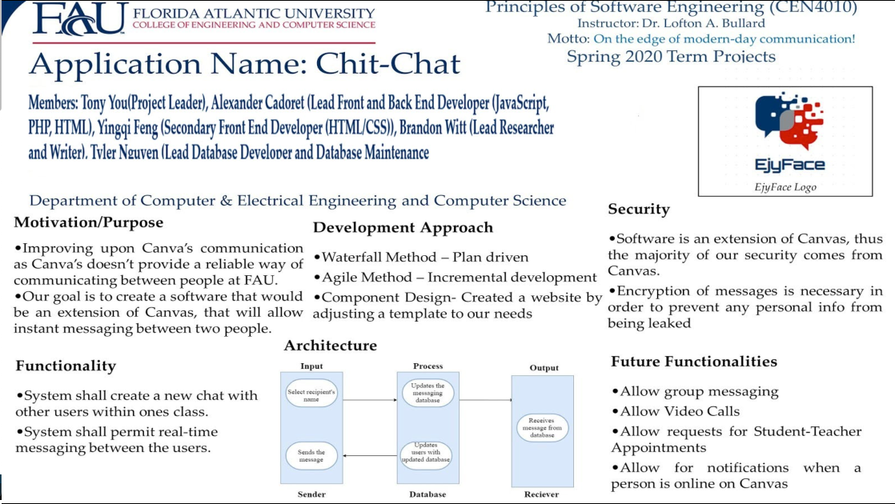

# 🎓 ChitChat_App 🎓

A Real-Time Messaging Web Application which used HTML/CSS/JS, PHP, and SQL to enhance communication experiences between FAU students and FAU professors
> Project for class CEN4010, Professor : Dr. Bullard
- - -
### Project Overview

- - -
### Demo Video

<iframe src="https://giphy.com/embed/VNiv3t2i7b1DHXuY6m" width="100%" height="100%" style="position:absolute" frameBorder="0" class="giphy-embed" allowFullScreen></iframe>

<a href="https://giphy.com/gifs/VNiv3t2i7b1DHXuY6m">Click to watch full video</a>

- - -
### ℹ️ Credits ℹ️
##### Group Name: 
EjyFace
##### Group Members : 
Alexander Cadoret
Yingqi Feng
Tyler Nguyen
Brandon Witt
Tony You

##### Member Roles:
|Name|Roles|Responsible|
|--|--|--|
|Tyler Nguyen|Lead Database Developer, Backend Developer, and Database Maintenance Tech|Created the database tables and ensures that the database is functioning properly|
|Alexander Cadoret|Lead Front and Back End Developer (Javascript, PHP, HTML|Helped create the website for our program, responsible for connecting the front-end to the back-end|
|Tony You|Project Leader|  Coordinated meetings, set daily goals, ensuring goals are on track, ensuring software is functioning accordingly (Tester), helped out in all parts of development, the relay between the outside world and the development team|
|Yingqi Feng|Secondary Front End Developer (HTML/CSS)|Helped create the website for our program and created the theme of the website and figured out the overall layout.
|Brandon Witt|Lead Researcher and Writer|Focused on gathering related information on our program, main writer for the research portion of the project, and helping resolve any roadblocks hit|

###### © EjyFace 2020

